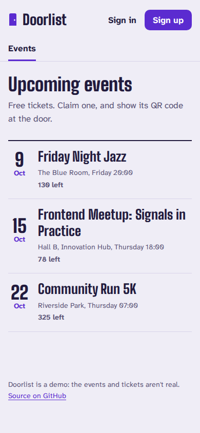
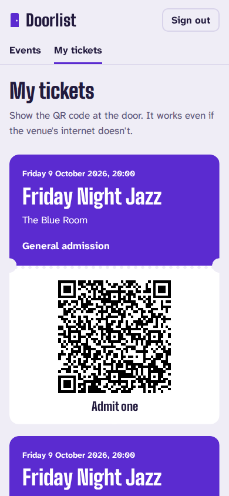
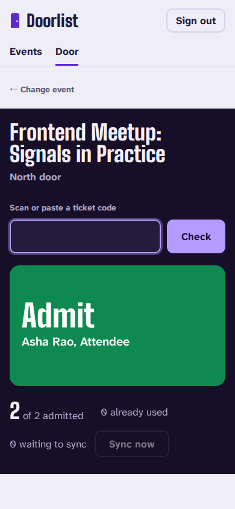
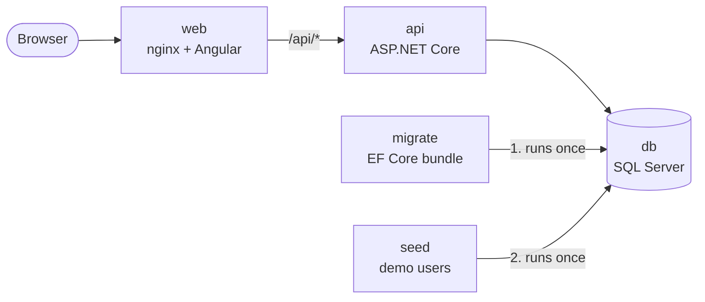

# Doorlist

Free event tickets with door check-in. Organizers create events with ticket types and capacities. Attendees sign up and claim tickets, each a QR code the server signs so it can be checked without a connection. Door staff scan tickets, offline if the venue's network drops, and scans sync when it comes back.

<p align="center">
  
  
  
</p>

More in [docs/screenshots](docs/screenshots), at desktop size and in dark mode. A Playwright spec captures them from a running stack (`SCREENSHOTS=1 scripts/e2e.sh screenshots`).

Doorlist is also a public reference project. Alongside the features, it shows how the whole product is built and run: an Angular front end, an ASP.NET Core API on SQL Server, EF Core migrations that run as their own deploy step and are checked against the running API, Docker, CI on every pull request, a rehearsed deploy pipeline, and the decisions behind each of these, written down.

> **Status:** [v1.0.0](CHANGELOG.md). Doorlist works end to end: events, sign-up, claiming, QR tickets, and door check-in that keeps working offline, tested in a real browser on every pull request. The deploy pipeline is built and rehearsed, and the live demo waits for its server. This project started as Shiplog, a release tracker ([ADR 6](docs/adr/0006-from-release-tracking-to-event-ticketing.md)).

## What it does

- **Events.** Organizers create an event as a draft, add ticket types with capacities, and publish it. Anyone can browse published events without an account.
- **Sign-up.** Anyone can create an account, and it's always an attendee account. Organizers and door staff are set up by an operator.
- **Claiming.** Attendees claim up to 4 tickets per event. However many people claim at once, an event never issues more than its capacity ([ADR 7](docs/adr/0007-signed-ticket-codes-and-claiming-without-overselling.md)).
- **Tickets.** Each ticket is a QR code of a signed code. Door devices can check it with the public key, without a connection.
- **Door check-in.** Door staff pick an event and scan tickets. A USB or Bluetooth QR scanner works as a keyboard, or they can paste the code.
  - **Online,** every scan goes to the server and its answer is final: admit, already used (with where and when), wrong event, or not valid.
  - **Offline,** the page checks each code's signature in the browser with WebCrypto, refuses tickets it has already let in, and queues the scans. It syncs them when the connection returns and flags any ticket another door admitted first ([ADR 8](docs/adr/0008-door-check-in-offline-first.md)).

## Stack

| Layer | Choice |
|---|---|
| Web | Angular (standalone components, signals, zoneless), served by nginx under a strict Content-Security-Policy; self-hosted fonts, light and dark themes, motion that respects reduced-motion settings |
| API | ASP.NET Core on .NET 10, minimal APIs, ProblemDetails, health checks |
| Data | SQL Server, EF Core code-first migrations ([ADR 2](docs/adr/0002-sql-server-with-ef-core-code-first.md)) |
| Auth | ASP.NET Core Identity, short-lived JWTs, role policies, attendee sign-up with rate limits ([ADR 4](docs/adr/0004-authentication-with-identity-and-jwt.md), [ADR 6](docs/adr/0006-from-release-tracking-to-event-ticketing.md)) |
| Tickets | Claims that can't oversell (atomic reservation, per-attendee lock, check constraint); ECDSA-signed QR codes checkable offline ([ADR 7](docs/adr/0007-signed-ticket-codes-and-claiming-without-overselling.md)) |
| Check-in | Idempotent batch scans, first admission enforced by a filtered unique index, duplicates flagged ([ADR 8](docs/adr/0008-door-check-in-offline-first.md)) |
| Migrations | EF Core migration bundle, run as a separate step before the API starts ([ADR 3](docs/adr/0003-run-migrations-as-a-separate-step.md)); every PR checked against the running API version, breaking changes in expand/contract steps ([docs/migrations.md](docs/migrations.md)) |
| Tests | xUnit integration tests against a real SQL Server (Testcontainers); Vitest unit tests; Playwright browser tests of the whole flow, online and offline, against the production build |
| Delivery | Docker multi-stage images, GHCR, GitHub Actions; staging then production (with approval) on one server behind Caddy ([ADR 5](docs/adr/0005-single-server-deploy-with-docker-compose.md), [deploy/](deploy/README.md)) |

## Architecture



The API never changes the schema itself. The migration bundle built from the same commit runs first, then the demo-user seed step, and the API starts only if both succeed.

## Run it

You need Docker with Compose. On Apple Silicon, see [CONTRIBUTING.md](CONTRIBUTING.md#apple-silicon).

```sh
docker compose up --build
```

- Web: http://localhost:8080
- API: http://localhost:5080. `/api/health` is open; everything else needs a token from `POST /api/auth/login`.

Local demo accounts, all with the password `Doorlist-demo-2026`. Anyone can also sign up as an attendee.

| Email | Role |
|---|---|
| `organizer@example.com` | Organizer: creates and publishes events |
| `door@example.com` | DoorStaff: checks tickets at the door (the Door page) |
| `attendee@example.com` | Attendee: claims tickets |

With the stack running, `scripts/e2e.sh` runs the browser tests in the official Playwright image. You don't need a local browser.

## Repository layout

```
api/                     ASP.NET Core API, EF Core, migrations, tests
  src/Doorlist.Api/
  tests/Doorlist.Api.Tests/
web/                     Angular app
  e2e/                   Playwright browser tests
mobile/                  Expo app for attendees and door staff (in progress)
docs/adr/                Architecture decision records
deploy/                  Server setup, Caddy, compose files and the deploy script
.github/workflows/       CI (build, tests, migration checks, schema compatibility, smoke and browser tests, mobile checks) and Deploy
scripts/                 Schema compatibility check, browser tests, deploy rehearsal, GitHub deploy setup
docker-compose.yml       Local stack
```

## Roadmap

| Milestone | Scope |
|---|---|
| 1. Skeleton ✅ | `docker compose up` runs end to end; CI on every pull request |
| 2. Domain and auth ✅ | The release tracker: apps, environments, releases, checklists; ASP.NET Core Identity + JWT with roles |
| 3. Deploy pipeline (built, waiting for the server) | Images to GHCR; staging then production with approval; settings check, backup, migrations, health check and rollback; Content-Security-Policy |
| 4. Expand/contract ✅ | A CI check that the running API survives each PR's migrations; a breaking schema change shipped in three steps that each pass it ([`docs/migrations.md`](docs/migrations.md)) |
| 5. Doorlist ✅ | Rename ✅; events, ticket types, attendee sign-up, claiming without overselling and signed QR tickets ✅; door check-in with offline sync ✅; the release tracker retired in steps ✅ ([ADR 6](docs/adr/0006-from-release-tracking-to-event-ticketing.md), [ADR 7](docs/adr/0007-signed-ticket-codes-and-claiming-without-overselling.md)) |
| 6. Mobile (in progress) | React Native (Expo) app: an attendee's tickets, and a door scanner that works offline ([ADR 9](docs/adr/0009-mobile-app-navigation-storage-and-offline-signatures.md)) |
| 7. Polish ✅ | Browser tests in CI, its own look, motion, screenshots, [`v1.0.0`](CHANGELOG.md). The live demo follows milestone 3's server. |

## Contributing

See [CONTRIBUTING.md](CONTRIBUTING.md) for the workflow, code standards and migration rules.

## License

[MIT](LICENSE)
