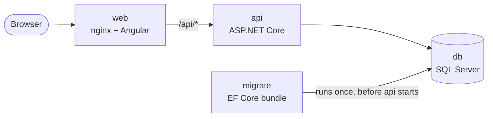

# Shiplog

A release tracker for teams that ship mobile and web apps. It keeps track of each app, its environments, its releases and the checklist each release has to pass. That checklist includes the check that catches the classic mistake of a staging build going to production: confirming the target environment and API URL before anything ships.

Shiplog is also a public reference project. Alongside the features, it shows how the whole product is built and run: an Angular front end, an ASP.NET Core API on SQL Server, EF Core migrations that run as their own deploy step, Docker, CI on every pull request, and the decisions behind each of these, written down.

> **Status:** milestone 1 of 5 (project skeleton). See the [roadmap](#roadmap).

## Stack

| Layer | Choice |
|---|---|
| Web | Angular (standalone components, signals), served by nginx |
| API | ASP.NET Core on .NET 10, minimal APIs, ProblemDetails, health checks |
| Data | SQL Server, EF Core code-first migrations ([ADR 2](docs/adr/0002-sql-server-with-ef-core-code-first.md)) |
| Migrations | EF Core migration bundle, run as a separate step before the API starts ([ADR 3](docs/adr/0003-run-migrations-as-a-separate-step.md)) |
| Tests | xUnit integration tests against a real SQL Server (Testcontainers) |
| Delivery | Docker multi-stage images, docker compose, GitHub Actions |

## Architecture



The API never changes the schema itself. Each release runs the migration bundle built from the same commit first, and starts the new API only if it succeeds.

## Run it

You need Docker with Compose. On Apple Silicon, see [CONTRIBUTING.md](CONTRIBUTING.md#apple-silicon).

```sh
docker compose up --build
```

- Web: http://localhost:8080
- API: http://localhost:5080. Try `/api/health` or `/api/apps`.

## Repository layout

```
api/                     ASP.NET Core API, EF Core, migrations, tests
  src/Shiplog.Api/
  tests/Shiplog.Api.Tests/
web/                     Angular app
docs/adr/                Architecture decision records
.github/workflows/ci.yml CI: build, tests, migration checks, full-stack smoke test
docker-compose.yml       Local stack
```

## Roadmap

| Milestone | Scope |
|---|---|
| 1. Skeleton | `docker compose up` runs end to end; CI on every pull request |
| 2. Domain and auth | Apps, environments, releases, checklists; ASP.NET Core Identity + JWT with roles; Angular release board |
| 3. Deploy pipeline | Images to GHCR; release workflow with env verification, DB backup, migration bundle, API rollout and health check; staging and production |
| 4. Expand/contract | A breaking schema change shipped across two releases with no downtime, documented in `docs/migrations.md` |
| 5. Polish | Demo account, screenshots, `v1.0.0` |

## Contributing

See [CONTRIBUTING.md](CONTRIBUTING.md) for the workflow, code standards and migration rules.

## License

[MIT](LICENSE)
