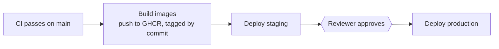
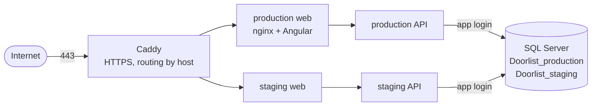

# Deploying Doorlist

Doorlist runs on one small Linux server ([ADR 5](../docs/adr/0005-single-server-deploy-with-docker-compose.md)). GitHub Actions deploys every green commit on `main` to **staging**, then to **production** once a reviewer approves.



On the server:



## What a deploy does

[`scripts/deploy.sh`](scripts/deploy.sh) runs on the server, once per environment:

1. **Checks the target.** The settings file must name this environment and its database, and its public host must match (no "staging" in production, and the reverse). A staging build can't go to production by mistake.
2. Starts Caddy and SQL Server if they aren't running.
3. **Creates the environment's database and two logins**, or syncs their passwords. The migrator owns the schema; the app login can only read and write data (ADR 3).
4. Pulls the images for the commit.
5. **Backs up the database** inside the SQL Server volume, keeping the newest 10.
6. Runs the migration bundle with the migrator login, then seeds the demo users.
7. Swaps in the new API and web containers.
8. **Health check** through nginx, the API and the database. If it fails, it goes back to the previous images and the deploy fails.

Steps 7 and 8 rely on every migration passing the schema compatibility check ([docs/migrations.md](../docs/migrations.md)): the previous API keeps working on the new schema, so going back to it is safe. A failure in steps 1–6 stops before any container changes, so the running version is untouched.

Rehearse all of this locally, with the failure paths exercised, before changing it:

```sh
scripts/rehearse-deploy.sh
```

## First-time setup

1. **Server.** Ubuntu 24.04 LTS on x86-64 (SQL Server has no ARM image), at least 2 GB of RAM, with ports 22, 80 and 443 open. Point `doorlist.devtownhall.com` and `doorlist-staging.devtownhall.com` at it with DNS-only A records, so Caddy can get certificates from Let's Encrypt.
2. **Deploy key.** Create a key that only GitHub Actions uses:
   ```sh
   ssh-keygen -t ed25519 -N "" -C doorlist-deploy -f doorlist-deploy
   ```
3. **Bootstrap the server**, as the default `ubuntu` user:
   ```sh
   ssh ubuntu@<server> 'bash -s' < deploy/server/bootstrap.sh "$(cat doorlist-deploy.pub)"
   ```
   This installs Docker, adds swap on small servers, turns on the firewall and automatic security updates, allows SSH keys only, and creates the `deploy` user.
4. **Configure GitHub:** environments, approval, variables and generated secrets:
   ```sh
   scripts/configure-github-deploy.sh <server> doorlist-deploy
   ```
   Then delete the local `doorlist-deploy` private key; GitHub has it.
5. **Turn deploys on**, and run the first one:
   ```sh
   scripts/configure-github-deploy.sh --enable
   gh workflow run deploy.yml
   ```

## Settings

| Where | Name | What |
|---|---|---|
| Repository variable | `DEPLOY_ENABLED` | `true` turns the workflow on |
| Repository variable | `PRODUCTION_HOST`, `STAGING_HOST` | Hostnames Caddy serves |
| Repository variable | `ACME_EMAIL` | Let's Encrypt account email |
| Repository variable | `MSSQL_MEMORY_LIMIT_MB` | SQL Server's memory cap (1024 on a 2 GB server) |
| Repository secret | `DEPLOY_HOST`, `DEPLOY_SSH_KEY`, `DEPLOY_KNOWN_HOSTS` | Where and how to SSH in |
| Repository secret | `MSSQL_SA_PASSWORD` | SQL Server admin. **Never change it** once the database volume exists: SQL Server reads it only on first start. |
| Environment variable | `PUBLIC_HOST` | This environment's hostname |
| Environment secret | `DB_MIGRATOR_PASSWORD`, `DB_APP_PASSWORD` | The two database logins; safe to rotate, since each deploy syncs them |
| Environment secret | `JWT_SIGNING_KEY` | Signs access tokens; rotating it signs everyone out |
| Environment secret | `DEMO_PASSWORD` | Password for the demo users; empty means no demo users |

## Operating it

Sign in to the server as `ubuntu` with your admin key. The deploy files live in `/opt/doorlist`.

- **What's running:**
  ```sh
  cat /opt/doorlist/production/current-tag
  docker compose ls
  ```
- **Roll back by hand** to an earlier commit's images. This is safe for any version from the last few merges, because each passed the compatibility check:
  ```sh
  sudo -u deploy /opt/doorlist/deploy/scripts/deploy.sh production <older-tag>
  ```
  The older migration bundle finds the newer migrations already applied and changes nothing: bundles only migrate forward. If that tag's images are no longer on the server, they come from GHCR. Either make the three `doorlist-*` packages public (they're built from this public repo), or `docker login ghcr.io` first with a token that can read packages.
- **List backups:**
  ```sh
  docker exec doorlist-shared-db-1 ls -lt /var/opt/mssql/backups/production
  ```
- **Restore a backup:** stop the API, restore, then start it again:
  ```sh
  docker compose -p doorlist-production stop api
  docker exec -it doorlist-shared-db-1 sh -c 'SQLCMDPASSWORD="$MSSQL_SA_PASSWORD" /opt/mssql-tools18/bin/sqlcmd -C -S localhost -U sa \
    -Q "RESTORE DATABASE [Doorlist_production] FROM DISK = N'"'"'/var/opt/mssql/backups/production/<file>.bak'"'"' WITH REPLACE"'
  docker compose -p doorlist-production start api
  ```
- **Off-server copies:** these backups live on the server's own disk. Turn on Lightsail's automatic daily snapshots, or copy the `.bak` files elsewhere, so a lost server doesn't mean lost data.
